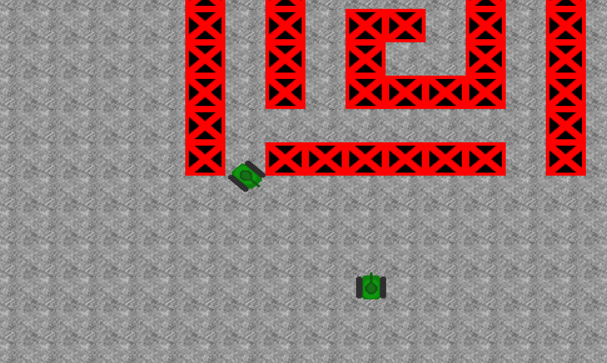

<h1>Wii tanks replica</h1>

<h2>SITREP(03.04.2023)</h2>
    

    Currently game is pretty simple, i used bomberman textures from this <a href="https://www.spriters-resource.com/fullview/7943/">website</a>. This because, another project i am working on at uni needs sprites for a bomberman game and i was really bad at drawing tank sprites.  
    <b>TODO List:</b>
        <ul>
            <li>Implemnet proper sprites, currently sprites kinda not work</li>
            <li>Create simple tank sprites, or buy some</li>
            <li>Implement some sort of map</li>
            <li>Implement collison with map and players, this will probably lead to needed exstension of controller</li>
        </ul>
    

